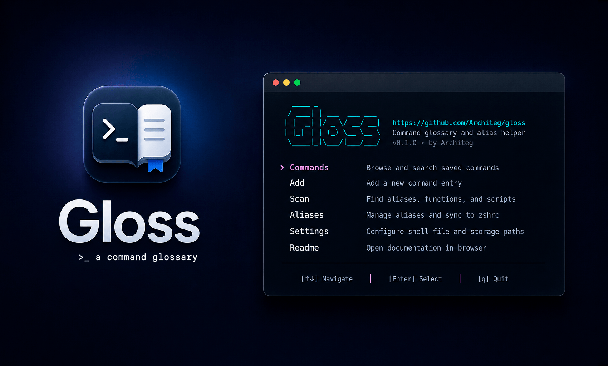
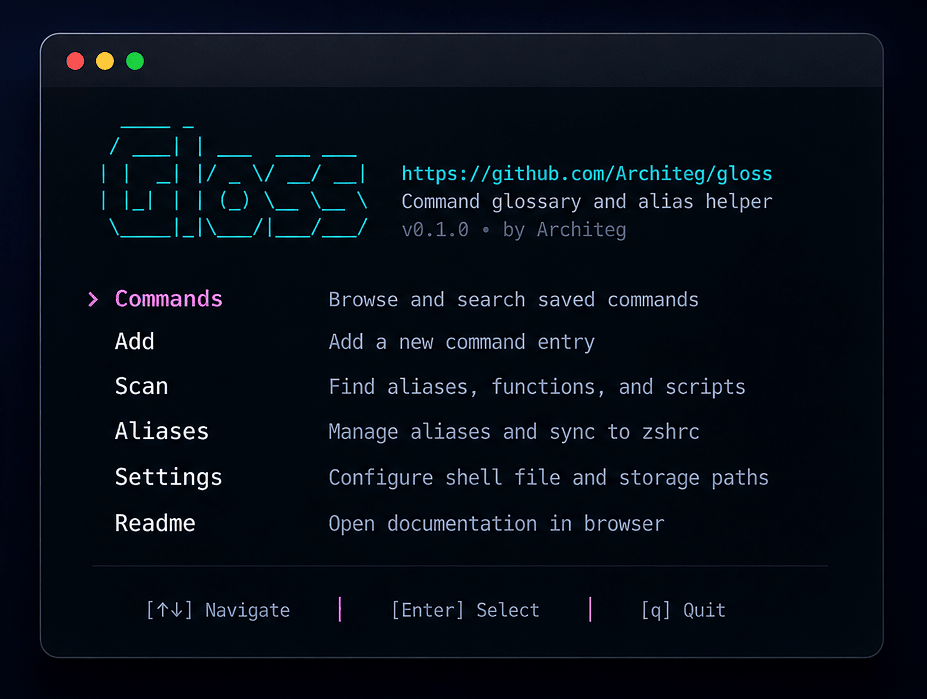

<div align="center">
  <h1>Gloss</h1>
  <p><em>A local-first command glossary for your terminal.</em></p>
</div><br/>

<!-- Badges-->

<p align="center">
  
  
  
  
  <a href="https://github.com/Architeg/gloss/commits/main">
    
  </a>
  <a href="https://github.com/Architeg/gloss/stargazers">
    
  </a>
  <a href="https://worksfine.dev">
    
  </a>
  <a href="#-support-gloss">
    
  </a>
</p>

<!-- Featured badges-->

<p align="center">
  <a href="https://www.uneed.best/tool/gloss">
    
  </a>
  &nbsp;
  <a href="https://www.producthunt.com/products/gloss?embed=true&utm_source=badge-featured&utm_medium=badge&utm_campaign=badge-gloss">
    
  </a>
  &nbsp;
  <a href="https://wired.business">
    
  </a>
</p>

Gloss keeps reusable shell commands organized, searchable, and ready when you need them.

I built it because I kept re-searching the same commands and spreading aliases across shell history, notes, and config files. Gloss gives those commands a small local home: descriptions, tags, TUI search, config scanning, and safe managed alias sync.

<p align="center">
  
</p>

## Features

- Save shell commands with descriptions and tags
- Browse, search, filter, add, edit, and delete entries in a TUI
- Scan zsh/bash configs for aliases, simple functions, and executable scripts
- Import only the scan suggestions you choose
- Add managed aliases without writing to your shell config immediately
- Preview and sync aliases into one dedicated managed block
- Create backups only when sync changes an existing shell file
- Store everything locally under `~/.config/gloss/`

## Platform support

- Officially supported: macOS with zsh
- Officially supported: Linux with bash
- Not officially supported yet: Windows

Default shell files:

- zsh → `~/.zshrc`
- bash → `~/.bashrc`
- bash scan also includes `~/.bash_aliases`

Existing config is never overwritten automatically. You can edit `~/.config/gloss/config.yaml` if you want to change shell or scan paths.

## Installation

### Option 1 - Install script

```bash
curl -fsSL https://raw.githubusercontent.com/Architeg/gloss/main/scripts/install.sh | bash
```

By default, the script installs Gloss to:

```bash
~/.local/bin/gloss
```

If `~/.local/bin` is not in your `PATH`, the installer prints the exact commands to add it.

Install a specific version:

```bash
curl -fsSL https://raw.githubusercontent.com/Architeg/gloss/main/scripts/install.sh -o /tmp/gloss-install.sh
VERSION=v0.1.0 bash /tmp/gloss-install.sh
```

### Option 2 - Homebrew

```bash
brew install Architeg/tap/gloss
```

If Homebrew behaves unexpectedly, check this:

```bash
echo "$HOMEBREW_NO_INSTALL_FROM_API"
```

If it returns `1`, unset it and retry:

```bash
unset HOMEBREW_NO_INSTALL_FROM_API
brew install Architeg/tap/gloss
```

You can also skip Homebrew auto-update during install:

```bash
HOMEBREW_NO_AUTO_UPDATE=1 brew install Architeg/tap/gloss
```

### Option 3 - Manual install

Download the correct asset from [GitHub Releases](https://github.com/Architeg/gloss/releases).

Example for macOS Apple Silicon:

```bash
unzip gloss-darwin-arm64.zip
chmod +x gloss-darwin-arm64
sudo mv gloss-darwin-arm64 /usr/local/bin/gloss
gloss version
```

## Quick start

Launch the TUI:

```bash
gloss
```

Or use direct CLI commands:

```bash
gloss help
gloss version
gloss list
gloss list --tag git
gloss scan
gloss add
gloss edit <command>
gloss delete <command>
gloss alias add
gloss alias sync
gloss alias delete <name>
```

## TUI overview

Main sections:

- **Commands** — browse, search, filter, open, add, edit, and delete saved commands
- **Add** — create a command entry with description and tags
- **Scan** — review aliases/functions/scripts found in configured scan paths
- **Aliases** — add, view, preview, sync, and delete managed aliases
- **Settings** — view shell file, storage path, scan paths, and config path
- **Readme** — built-in help

<p align="center">
  
</p>

Common keys:

- `↑` / `↓` — move
- `Enter` — open, select, or confirm
- `Esc` — go back
- `q` — quit
- `/` — search where available
- `F` — filter where available
- `Space` — toggle scan/import items where available

## Commands screen

The **Commands** screen is the main glossary browser.

You can:

- browse saved entries grouped by tag
- open entry details
- add new entries
- edit existing entries
- delete entries
- search by command/description
- filter by tag

Entries without tags are shown under **Untagged**.

```bash

───────────────────────────── Commands ─────────────────────────────                          

Search:   > substring in command or description                                              
Tag:      > exact tag                                                                        


› Category: Git
───────────────────────

  gs                    git status
  ga                    git add .
  gc                    git commit -m
  gp                    git push                                                     


› Category: Tools
───────────────────────

  nano                  Open nano editor
  serve                 Start a local static file server
  updatebrew            brew update && brew upgrade                                               


› Category: Network
───────────────────────

  headers               curl -I
  pingg                 ping github.com
  myip                  curl ifconfig.me
  dns                   dig
  speed                 networkQuality


/ Search │ F Filter │ E Edit │ D Delete │ A Add │ ↑↓ Move │ Enter Open │ Esc Back │ Q Quit  
```


## Scan and import

Gloss can detect:

- aliases from your configured shell file
- zsh aliases from `~/.zshrc`
- bash aliases from `~/.bashrc` and `~/.bash_aliases`
- simple shell functions
- executable files in configured scan directories

Scan suggestions are selected by default. Use the TUI **Scan** screen to toggle and import only the entries you want.

Imported scan entries are intentionally added without tags by default. This keeps bulk import fast; you can tag entries later.

## Managed aliases

Gloss treats managed aliases as normal glossary entries with extra sync behavior.

Add a managed alias:

```bash
gloss alias add
```

Preview and sync from the TUI, or sync directly:

```bash
gloss alias sync
```

Gloss writes aliases only inside this managed block:

```zsh
# >>> gloss aliases >>>
alias gs="git status"
alias ll="ls -lah"
# <<< gloss aliases <<<
```

When syncing, Gloss will:

1. Build the managed alias block
2. Replace the existing Gloss-managed block if it exists
3. Append the block if it does not exist
4. Leave unrelated shell config untouched

If the generated block already matches the shell file, Gloss does not rewrite the file and does not create a backup.

Delete a managed alias:

```bash
gloss alias delete <name>
```

Then sync again to remove it from the managed block.

## Safety and backups

Backups are created only when:

- the shell file already exists
- sync is actually going to modify it

No backup is created when:

- Gloss creates a missing shell file for the first time
- sync detects there is no change to write

Backup names look like this:

```bash
~/.zshrc.gloss.bak-20260423-223500
~/.bashrc.gloss.bak-20260423-223500
```

Old Gloss-created backups are pruned automatically.

## Configuration

Gloss stores config and data under:

```bash
~/.config/gloss/
```

Typical files:

```bash
~/.config/gloss/config.yaml
~/.config/gloss/gloss.db
```

Example macOS/zsh config:

```yaml
shell_file: /Users/yourname/.zshrc
storage_path: /Users/yourname/.config/gloss
scan_paths:
  - /Users/yourname/.zshrc
use_color: true
```

Example Linux/bash config:

```yaml
shell_file: /home/yourname/.bashrc
storage_path: /home/yourname/.config/gloss
scan_paths:
  - /home/yourname/.bashrc
  - /home/yourname/.bash_aliases
use_color: true
```

## Uninstall

Remove the binary:

```bash
rm -f "$HOME/.local/bin/gloss"
```

If installed system-wide:

```bash
sudo rm -f /usr/local/bin/gloss
```

If installed with Homebrew:

```bash
brew uninstall gloss
```

Optional: remove local data and config:

```bash
rm -rf "$HOME/.config/gloss"
```

Optional: remove the managed alias block from `~/.zshrc` or `~/.bashrc`:

```zsh
# >>> gloss aliases >>>
# ...
# <<< gloss aliases <<<
```

If the install script added Gloss to your `PATH`, remove this block from your shell config:

```bash
# --- Path to Gloss ---
export PATH="$HOME/.local/bin:$PATH"
```

## What Gloss is not

Gloss is not a shell replacement, history analyzer, package manager, AI command explainer, full shell plugin manager, or cloud sync product.

It is a small local utility for documenting, finding, importing, and safely syncing useful shell commands.

## Development

Clone the repo:

```bash
git clone https://github.com/Architeg/gloss.git
cd gloss
```

Run locally:

```bash
go run ./cmd/gloss
```

Build:

```bash
go build ./cmd/gloss
```

Check version:

```bash
go run ./cmd/gloss version
```

## ⭐ Support Gloss

If Gloss saves you time or becomes part of your workflow, you can [share it](https://twitter.com/intent/tweet?url=https://github.com/Architeg/gloss&text=Gloss%20%E2%80%94%20A%20small%20command%20glossary%20for%20your%20terminal.), [give it a star](https://github.com/Architeg/gloss/stargazers), or support the project here:

[](https://github.com/sponsors/Architeg)  
[](https://ko-fi.com/architeg)

## Contributing

Issues, suggestions, and small focused PRs are welcome.

Please keep changes simple, readable, and focused on the core workflow.

Thanks to everyone who contributes to Gloss. ❤️

See the [contributors graph](https://github.com/Architeg/gloss/graphs/contributors).

## License

MIT. See [LICENSE](./LICENSE).
