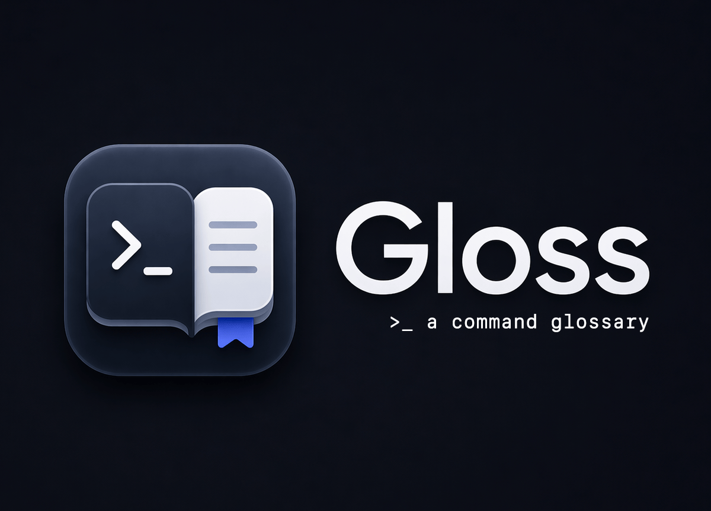

<div align="center">
  <h1>Gloss</h1>
  <p><em>A command glossary for your terminal.</em></p>
</div>

<p align="center">
  
  
  
  
  <a href="https://github.com/Architeg/gloss/commits/main">
    
  </a>
  <a href="https://github.com/Architeg/gloss/stargazers">
    
  </a>
  <a href="https://worksfine.app">
    
  </a>
</p>

Gloss helps you save useful shell commands, organize them with tags, scan your zsh config, and safely manage a dedicated alias block in `~/.zshrc`.

It is small, local-first, keyboard-first, and terminal-native.

<p align="center">
  
</p>

## ✅ Features

### Command glossary

- Save command entries with descriptions and tags
- Browse entries in a clean terminal UI
- Search and filter in the TUI
- Add, edit, and delete entries

### Scan and import

- Scan `~/.zshrc` and configured scan paths
- Detect aliases
- Detect simple shell functions
- Detect executable files in configured directories
- Import selected suggestions into the glossary

### Managed aliases

- Add aliases directly from Gloss
- Preview the generated managed alias block
- Sync only the managed block into `~/.zshrc`
- Delete managed aliases cleanly
- Avoid rewriting the shell file when nothing changed

### Safety

- Backups are created only when sync actually changes an existing shell file
- Old Gloss-created backups are pruned automatically
- Alias add does not auto-sync
- Managed aliases stay inside a dedicated block

### CLI + TUI

- Use the interactive TUI for browsing, editing, and importing
- Use direct CLI commands for quick add/list/scan/edit/delete/version workflows


## Platform support

- **Officially supported:** macOS
- **Likely workable / experimental:** Linux
- ❌ **Not officially supported yet:** Windows

Gloss is currently built around zsh-style shell integration, especially for alias sync.

## 💾 Installation

### 🔽 Option 1 — Install script

```bash
curl -fsSL https://raw.githubusercontent.com/Architeg/gloss/main/scripts/install.sh | bash
```
By default, the script installs Gloss to `~/.local/bin/gloss`.

> [!NOTE]
> If ~/.local/bin is not in your PATH, the installer will print the exact commands to add it to your shell config.

Install a specific version:

```bash
curl -fsSL https://raw.githubusercontent.com/Architeg/gloss/main/scripts/install.sh -o /tmp/gloss-install.sh
VERSION=v0.1.0 bash /tmp/gloss-install.sh
```

After installation:

```bash
gloss version
```

### 🔽 Option 2 — Homebrew

```bash
brew install Architeg/tap/gloss
```

Then:

```bash
gloss version
```

> [!NOTE]
> On some Homebrew setups, install may try to use a non-API path and behave unexpectedly.

Check this first:

```bash
echo "$HOMEBREW_NO_INSTALL_FROM_API"
```

If it returns `1`, unset it:

```bash
unset HOMEBREW_NO_INSTALL_FROM_API
```

Then retry:

```bash
brew install Architeg/tap/gloss
```

You can also skip auto-update during install:

```bash
HOMEBREW_NO_AUTO_UPDATE=1 brew install Architeg/tap/gloss
```

### 🔽 Option 3 — Manual install from GitHub Releases

Download the correct asset for your platform from the Releases page, then install manually.

Example for macOS Apple Silicon:

```bash
unzip gloss-darwin-arm64.zip
chmod +x gloss-darwin-arm64
sudo mv gloss-darwin-arm64 /usr/local/bin/gloss
gloss version
```

## 🗑️ Uninstall

If you installed Gloss with the install script, remove the binary:

```bash
rm -f "$HOME/.local/bin/gloss"
```
If you installed it system-wide:

```bash
sudo rm -f /usr/local/bin/gloss
```

If you installed with Homebrew:

```bash
brew uninstall gloss
```

Optional: remove local Gloss data and config:
```bash
rm -rf "$HOME/.config/gloss"
```
Optional: remove the managed alias block from your shell config manually:

```zsh
# >>> gloss aliases >>>
# ...
# <<< gloss aliases <<<
```
---

## 🚀 Quick start

Launch the TUI:

```bash
gloss
```

Or use direct CLI commands:

```bash
gloss help
gloss version
gloss list
gloss scan
gloss add
gloss edit <command>
gloss delete <command>
gloss alias add
gloss alias sync
gloss alias delete <name>
```

## CLI commands

### Version

```bash
gloss version
gloss --version
gloss -v
```

### Help

```bash
gloss help
```

### Add an entry

```bash
gloss add
```

Prompts for:

- command
- description
- tags

### List entries

```bash
gloss list
```

Filter by tag:

```bash
gloss list --tag git
```

### Scan sources

```bash
gloss scan
```

CLI scan is print-only.

Use the TUI **Scan** screen to select and import suggestions interactively.

### Edit an entry

```bash
gloss edit <command>
```

### Delete an entry

```bash
gloss delete <command>
```

### Managed aliases

Add a managed alias:

```bash
gloss alias add
```

Delete a managed alias:

```bash
gloss alias delete <name>
```

Sync managed aliases into your shell file:

```bash
gloss alias sync
```

## 🧩 TUI overview

Run:

```bash
gloss
```

Main sections:

- **Commands**
- **Add**
- **Scan**
- **Aliases**
- **Settings**
- **Readme**

The Home screen also includes support links.

### Navigation

Gloss is keyboard-first.

Common keys:

- `↑` / `↓` — move
- `←` / `→` — switch support links on Home when that row is focused
- `Enter` — open / select / confirm
- `Esc` — go back
- `q` — quit

Gloss also supports Vim-style navigation in some places where applicable.


## 1. Commands screen

The **Commands** screen is the main glossary browser.

You can:

- browse saved entries grouped by tag
- open entry details
- add new entries
- edit existing entries
- delete entries
- search by command/description
- filter by tag

Entries without tags are shown under **Untagged**.

## 2. Add entry

The **Add** screen lets you create a new glossary entry directly from the TUI.

Each entry includes:

- command
- description
- tags

Tags are comma-separated, for example:

```text
git, shell, docker
```

After saving, the entry appears in the **Commands** screen under its tag group. If no tags are added, the entry appears under **Untagged**.

## 3. Scan and import

Use the **Scan** screen in the TUI for the full workflow.

Gloss can detect:

- aliases from `~/.zshrc`
- aliases/functions from configured scan files
- executable files from configured scan directories

### Scan behavior

- suggestions are selected by default
- use `Space` to toggle items
- imported suggestions disappear after import
- remaining suggestions stay visible
- existing commands already in the glossary are skipped

### Why imported scan entries are uncategorized

Imported items are intentionally added without tags by default.

This keeps bulk import fast and avoids a prompt loop when scanning larger configs. You can tag them later if needed.

## 4. Managed aliases

Gloss treats managed aliases as normal glossary entries with extra sync behavior.

### Add a managed alias

In the TUI:

1. Open **Aliases**
2. Choose **Add managed alias**

Or via CLI:

```bash
gloss alias add
```

This stores the alias in Gloss but does **not** immediately write to `~/.zshrc`.

### Preview sync block

Before syncing, Gloss can show the exact block it will write:

```zsh
# >>> gloss aliases >>>
alias gs="git status"
alias ll="ls -lah"
# <<< gloss aliases <<<
```

### Sync behavior

When you sync:

```bash
gloss alias sync
```

Gloss will:

1. Build the managed alias block
2. Replace the existing Gloss-managed block if it exists
3. Append the block if it does not exist
4. Leave unrelated shell file content untouched

### No-op sync

If the generated block matches what is already in the shell file:

- Gloss does **not** rewrite the file
- Gloss does **not** create a backup
- Gloss shows an “already up to date” style message

### Delete a managed alias

Delete it from the TUI managed aliases list or via CLI:

```bash
gloss alias delete gs
```

Then sync again, and it will disappear from the managed block in `~/.zshrc`.

## Safety and backups

Gloss is conservative by design.

### When backups are created

Backups are created **only** when:

- the shell file already exists
- sync is actually going to modify it

### When backups are not created

No backup is created when:

- there is no shell file yet and Gloss creates it for the first time
- sync detects there is no change to write

### Backup naming

Gloss uses timestamped backups, for example:

```bash
~/.zshrc.gloss.bak-20260423-223500
```

Old Gloss-created backups are pruned automatically to keep only a small recent set.

## 5. Settings

For v1, Settings is intentionally minimal and read-only.

It shows:

- shell file path
- storage path
- scan paths
- config file path

If needed, you can edit config manually.

## Configuration

Gloss stores config and data under:

```bash
~/.config/gloss/
```

Typical files:

```bash
~/.config/gloss/config.yaml
~/.config/gloss/gloss.db
```

Example config:

```yaml
shell_file: /Users/yourname/.zshrc
storage_path: /Users/yourname/.config/gloss
scan_paths:
  - /Users/yourname/.zshrc
use_color: true
```

### Config fields

- `shell_file` — shell file used for managed alias sync
- `storage_path` — location of the SQLite DB and config file
- `scan_paths` — extra files/directories to scan
- `use_color` — basic color preference

## Install paths

### Binary

Typical install location:

```bash
/usr/local/bin/gloss
```

### Config/data

Typical runtime location:

```bash
~/.config/gloss/
```

---

## 🎯 Supported workflow

Gloss is best suited for people who:

- keep useful shell aliases but forget them later
- want a simple personal command glossary
- want a lightweight terminal UI instead of a docs file
- want managed aliases in a dedicated safe block
- use zsh on macOS or similar Unix-like environments

## What Gloss is not

Gloss is intentionally **not**:

- a shell replacement
- a shell history analyzer
- a package manager
- an AI command explainer
- a full shell plugin manager
- a cloud sync product

It is a small local utility for documenting and managing useful commands.

## 👨🏻‍💻 Development

Clone the repo:

```bash
git clone https://github.com/Architeg/gloss.git
cd gloss
```

Run locally:

```bash
go run ./cmd/gloss
```

Build:

```bash
go build ./cmd/gloss
```

Check version:

```bash
go run ./cmd/gloss version
```

## Release assets

GitHub Releases provide the official binaries for:

- `darwin-arm64`
- `darwin-amd64`
- `linux-amd64`
- `linux-arm64`

These release assets are used by:

- manual installs
- the install script
- the Homebrew formula

## Roadmap ideas

Possible future improvements:

- cleaner CLI output formatting
- editable settings in TUI
- richer alias management
- better Linux shell integration
- shell completions
- import/export helpers
- `gloss --version` metadata with commit/date
- more polished release automation

---

## ⭐ Support Gloss

If Gloss saves you time or becomes part of your workflow, you can [share it](https://twitter.com/intent/tweet?url=https://github.com/Architeg/gloss&text=Gloss%20%E2%80%94%20A%20small%20command%20glossary%20for%20your%20terminal.), maybe [give it a star](https://github.com/Architeg/gloss/stargazers), or support the project here:

- [GitHub Sponsors](https://github.com/sponsors/Architeg)
- [Ko-fi](https://ko-fi.com/example)
- [Buy Me a Coffee](https://buymeacoffee.com/example)

## Contributing

Issues, suggestions, and small focused PRs are welcome.

If you contribute:

- keep the UI restrained
- prefer simple and readable code
- avoid unnecessary abstraction
- avoid feature creep for the core workflow

## License

MIT

See [LICENSE](./LICENSE).
